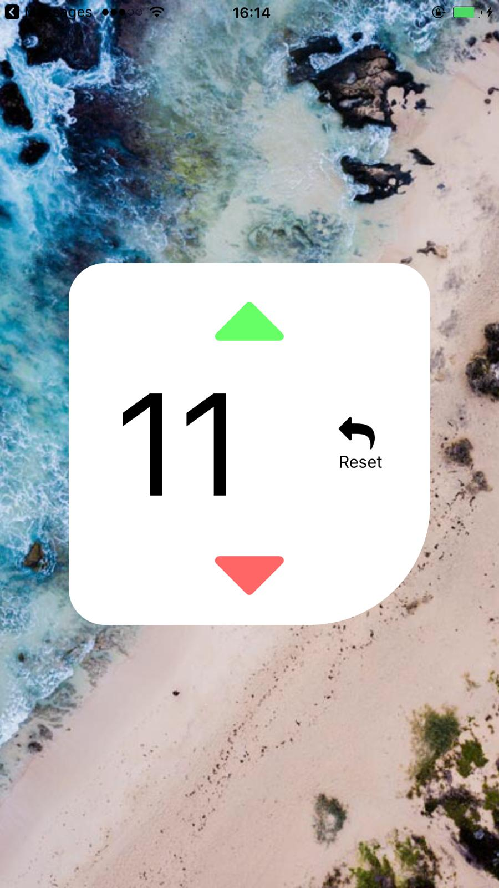

# Wave Counter 🏖️
Simple counter app based on React Native + Redux
```
"Just perfect to count waves on the beach 🌊"
```

## QuickStart

Prepare your simulator / real device (using [Expo](https://expo.io/))

```
npm install
npm start
``` 
Note: tested on real device (iPhone 6 Plus)

## Example

